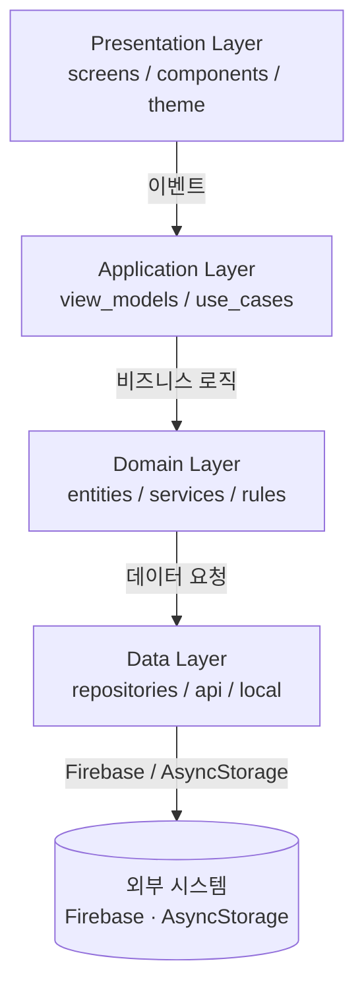

# Architecture — 당근나라

## 시스템 개요

중고거래 앱 "당근나라"은 **레이어드 아키텍처**로 설계되었다.
각 레이어는 단방향으로만 의존하며, 변경의 영향 범위를 최소화한다.

---

## 레이어 구조



---

## 레이어 책임

| 레이어 | 책임 | 포함 파일 |
|--------|------|-----------|
| **Presentation** | 화면 렌더링, 사용자 입력 처리 | screens/, components/, theme/ |
| **Application** | 상태 관리, 유스케이스 조율 | view_models/, use_cases/, store/ |
| **Domain** | 핵심 비즈니스 규칙 (플랫폼 독립) | entities/, services/, rules/ |
| **Data** | 외부 API, 로컬 저장소 추상화 | repositories/, api/, local/ |

---

## 핵심 기능별 레이어 흐름

| 기능 | Presentation | Application | Domain | Data |
|------|-------------|-------------|--------|------|
| 상품 목록 조회 | HomeScreen | ProductListViewModel | Product entity | ProductRepository → Firestore |
| 상품 등록 | SellScreen | CreateProductUseCase | Product 유효성 검사 | ProductRepository → Firestore + Storage |
| 채팅 | ChatScreen | ChatViewModel | Message entity | ChatRepository → Firestore onSnapshot |
| 로그인 | LoginScreen | AuthViewModel | User entity | AuthRepository → Firebase Auth |

---

## 디렉토리 구조

```
src/
├── presentation/
│   ├── screens/
│   │   ├── HomeScreen.tsx
│   │   ├── DetailScreen.tsx
│   │   ├── SellScreen.tsx
│   │   ├── ChatScreen.tsx
│   │   ├── ProfileScreen.tsx
│   │   └── LoginScreen.tsx
│   ├── components/
│   │   ├── ProductCard.tsx
│   │   ├── CategoryFilter.tsx
│   │   ├── ChatBubble.tsx
│   │   └── WishlistButton.tsx
│   └── theme/
│       ├── colors.ts
│       ├── typography.ts
│       └── spacing.ts
├── application/
│   ├── view_models/
│   │   ├── useProductList.ts
│   │   ├── useChat.ts
│   │   └── useAuth.ts
│   ├── use_cases/
│   │   ├── CreateProductUseCase.ts
│   │   └── SendMessageUseCase.ts
│   └── store/
│       └── useAppStore.ts  (Zustand)
├── domain/
│   ├── entities/
│   │   ├── Product.ts
│   │   ├── User.ts
│   │   └── Message.ts
│   └── services/
│       └── PriceValidator.ts
└── data/
    ├── repositories/
    │   ├── ProductRepository.ts
    │   └── ChatRepository.ts
    ├── api/
    │   └── firebaseConfig.ts
    └── local/
        └── AsyncStorageHelper.ts
```

---

## 기술 스택

| 영역 | 기술 |
|------|------|
| 프레임워크 | React Native (Expo) |
| 언어 | TypeScript |
| 상태 관리 | Zustand |
| 백엔드 | Firebase (Firestore, Auth, Storage) |
| 네비게이션 | React Navigation v6 |
| 이미지 | expo-image-picker |
| 아이콘 | @expo/vector-icons |
